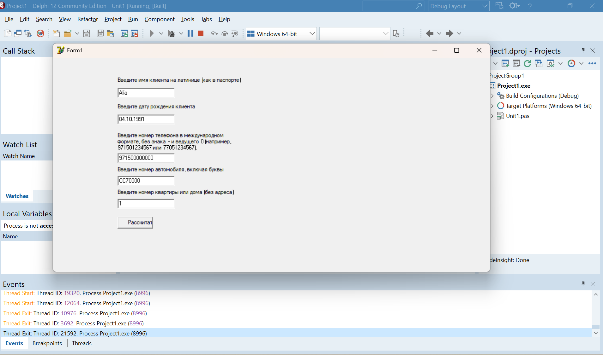
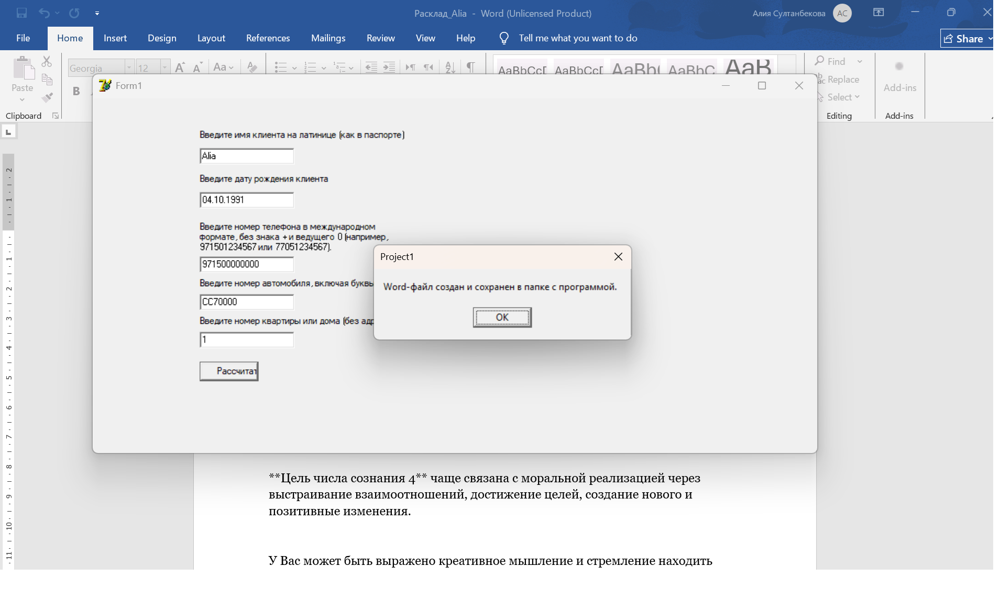
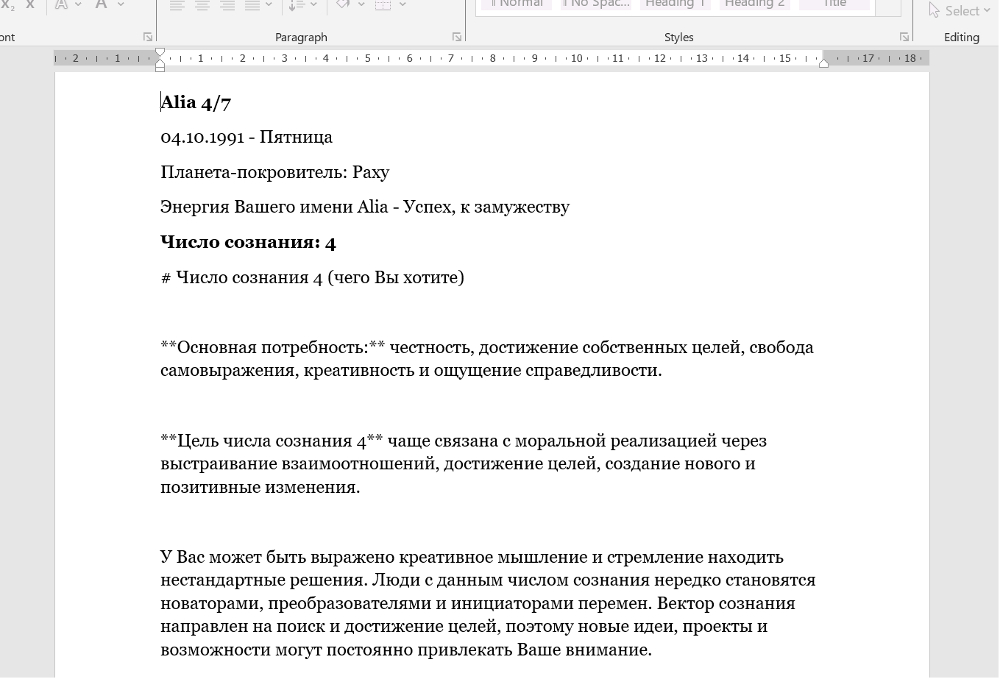
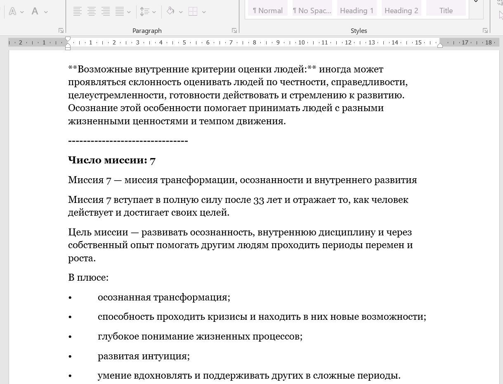
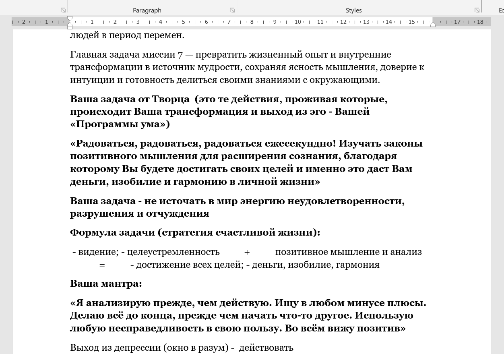
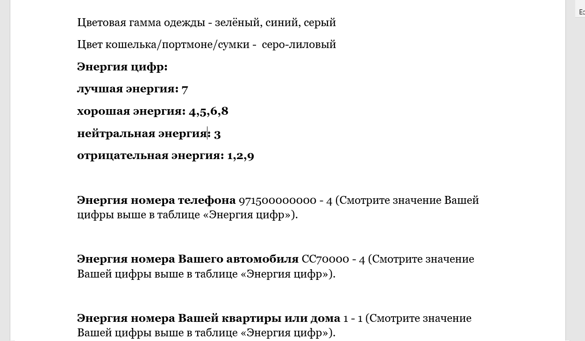
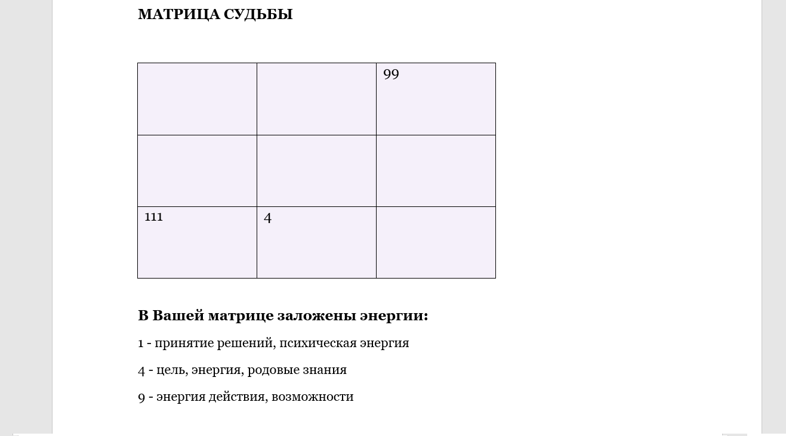
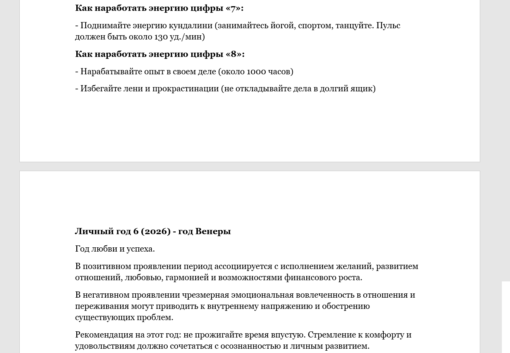

# Syutsai — Numerology Analysis Desktop Application

A desktop application developed with **Delphi / Object Pascal** for automated numerology calculations and report generation.

> **Note:** The application interface and generated reports are currently in Russian.

---

## About the Project

Syutsai is a desktop application designed to automate a set of numerology calculations based on personal information entered by the user.

The application combines calculation logic, database integration, and automated Microsoft Word report generation.

This project was developed as a standalone Windows desktop application using Delphi.

---

## Key Features

- Personal data input
- Numerology calculations based on date of birth
- Name energy calculation
- Phone number energy calculation
- Car number energy calculation
- House/apartment number calculation
- Personal year calculation
- Numerical matrix generation
- Retrieval of calculation-related information from a database
- Automated Microsoft Word report generation
- Formatted reports with structured calculation results

---

## Technologies

- **Delphi / Object Pascal**
- **Microsoft Access**
- **ADO (ActiveX Data Objects)**
- **Microsoft Word Automation**
- **OLE Automation**

---

## Database

The application uses a **Microsoft Access database** to store and retrieve the data required for the calculations and generated reports.

The database is accessed from the Delphi application using ADO.

The production database is not included in this repository.

---

## Microsoft Word Automation

One of the key features of the application is automated report generation.

After completing the calculations, the application creates a formatted Microsoft Word document containing the user's results and related information.

This demonstrates integration between a Delphi desktop application and Microsoft Word through OLE Automation.

---

## Screenshots

### Main Application

### Calculation Results

### Generated Word Report

---

## Project Structure

The project consists of a Delphi desktop application, a Microsoft Access database, calculation logic, and automated report generation.

The production executable and database are intentionally not included in this public repository.

---

## Security & Privacy

No personal user data or production database is included in this repository.

The application screenshots are provided for portfolio and demonstration purposes only.

---

## Project Status

**Completed — Desktop Version**

The current version is a Windows desktop application developed with Delphi.

---

## Future Development

A cross-platform mobile version of Syutsai is planned using:

- **Flutter**
- **Dart**
- **Supabase / PostgreSQL**
- User authentication
- Subscription-based features
- Android and iOS support

The mobile version will be developed as a new cross-platform application while preserving the core calculation logic of the desktop version.

---

## Author

**Alia Sultanbekova**

Software Development Portfolio

---

## Language

**Application UI:** Russian  
**Generated Reports:** Russian  
**Project Documentation:** English
